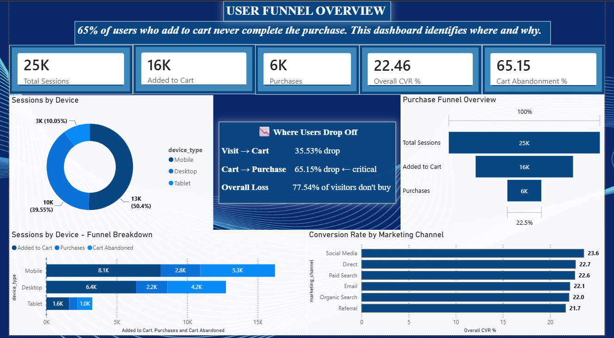
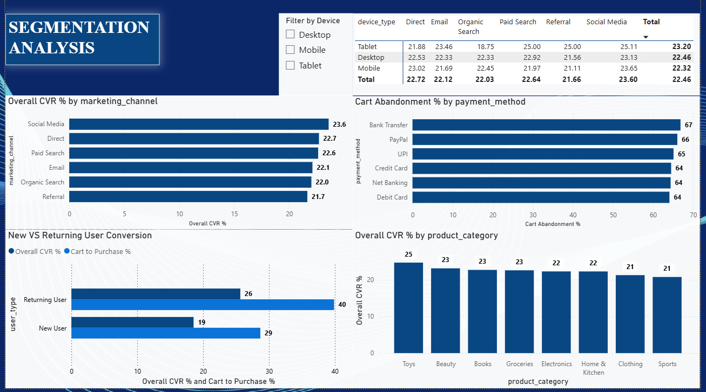
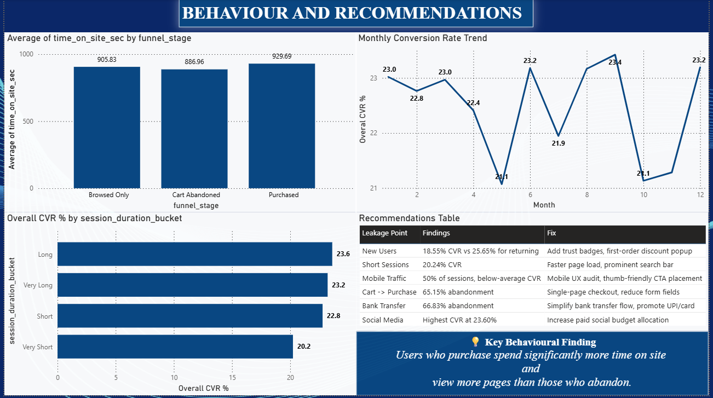

# 🛒 User Journey & Conversion Drop-off Analysis in E-Commerce 

## 📌 Project Overview

In e-commerce, cart abandonment directly translates to lost revenue. This project analyses **25,000 user sessions** from an e-commerce platform to identify exactly where users drop off in the purchase funnel, which segments have the highest leakage, and what business actions can reduce abandonment and improve conversion.

**Tools Used:** Python (Pandas) · MySQL · Power BI  
**Dataset:** 25,000 e-commerce sessions | 27 features | Full year 2024

---

## ❗ Problem Statement

> *65% of users who add an item to cart never complete the purchase.*  
> This project identifies where, why, and which user segments are most affected — and provides actionable recommendations to fix it.

---

## 📊 Dashboard Preview

### Page 1 — Funnel Overview


### Page 2 — Segmentation Analysis


### Page 3 — Behaviour & Recommendations


---

## 🔍 Key Findings

### Funnel Summary

| Stage | Count | Rate |
|---|---|---|
| Total Visits | 25,000 | 100% |
| Added to Cart | 16,117 | 64.47% |
| Purchases | 5,616 | 22.46% overall |
| Cart Abandoned | 10,501 | **65.15%** ← main leakage point |

> The funnel is not broken at discovery — 64% of visitors add to cart, which is healthy. The problem is cart-to-purchase conversion, where **2 in 3 users drop off**.

---

### Segmentation Insights

**By Device**
| Device | Sessions | Overall CVR | Abandonment Rate |
|---|---|---|---|
| Tablet | 2,513 | 23.20% | 64.23% |
| Desktop | 9,887 | 22.46% | 65.16% |
| Mobile | 12,600 | 22.32% | 65.34% |

> Mobile drives 50% of all traffic but has the lowest conversion rate — a clear mobile UX problem.

**By Marketing Channel**
| Channel | CVR |
|---|---|
| Social Media | 23.60% |
| Direct | 23.13% |
| Paid Search | 22.64% |
| Email | 22.12% |
| Organic Search | 22.03% |
| Referral | 21.66% |

> Social Media is the highest-converting channel. Referrals bring traffic that doesn't convert.

**By User Type**
| User Type | Cart-to-Purchase | Overall CVR |
|---|---|---|
| Returning User | 39.88% | 25.65% |
| New User | 28.69% | 18.55% |

> Returning users convert at **38% higher rate** than new users — driven by trust and familiarity.

**By Payment Method**
| Payment Method | Abandonment Rate |
|---|---|
| Bank Transfer | 66.83% |
| PayPal | 66.04% |
| UPI | 65.59% |
| Credit Card | 64.82% |
| Net Banking | 64.63% |
| Debit Card | 63.62% |

> Bank Transfer and PayPal show the highest cart abandonment — friction in these payment flows is costing conversions.

**By Product Category**
| Category | CVR |
|---|---|
| Toys | 24.68% |
| Beauty | 23.12% |
| Books | 23.00% |
| Groceries | 22.76% |
| Electronics | 22.44% |
| Home & Kitchen | 22.33% |
| Clothing | 21.88% |
| Sports | 20.76% |

---

### Behavioural Insights

- Users who **purchased** spent the most time on site (929s avg) vs cart abandoners (886s) — engagement drives conversion
- **Short session users** convert at only 20.24% vs Long session users at 23.62%
- Monthly CVR fluctuates between 21%–23.6%, suggesting seasonal sensitivity

---

## 💡 Recommendations

| Leakage Point | Finding | Fix |
|---|---|---|
| Cart → Purchase | 65.15% abandonment | Single-page checkout, reduce form fields |
| New Users | 18.55% CVR vs 25.65% for returning | Trust badges, first-order discount popup |
| Bank Transfer | 66.83% abandonment | Simplify flow, promote UPI/Debit Card |
| Mobile Traffic | 50% of sessions, lowest CVR | Mobile UX audit, thumb-friendly CTA placement |
| Short Sessions | 20.24% CVR | Faster page load, prominent search bar |
| Social Media | Highest CVR at 23.60% | Increase paid social budget allocation |

---

## 🗂️ Project Structure
```
User-Funnel-Analysis/
├── README.md
├── user_funnel_analysis.zip
│   ├── data/
│   │   └── Ecommerce_clean.csv
│   ├── sql_file/
│   │   └── funnel_analysis.sql
│   └── powerbi_file/
│       ├── funnel_analysis_dash.pbix
│       ├── page1_user_funnel_overview.png
│       ├── page2_segmentation_analysis.png
│       └── page3_behaviour_recommendations.png
```

## ⚙️ How to Run

**SQL Analysis**
1. Import `Ecommerce_clean.csv` into MySQL as table `ecommerce`
2. Open `funnel_analysis.sql` in MySQL Workbench
3. Run section by section — each section is clearly labelled

**Power BI Dashboard**
1. Open Power BI Desktop
2. Get Data → Text/CSV → select `Ecommerce_clean.csv`
3. View the exported dashboard: `funnel_analysis_dash.pbix`

---

## 🛠️ Data Preparation

The original dataset had all categorical columns label-encoded as integers. Pre-processing done in Python (Pandas):

| Column | Original | Decoded |
|---|---|---|
| device_type | 0, 1, 2 | Desktop, Mobile, Tablet |
| marketing_channel | 0–5 | Direct, Email, Organic Search, Paid Search, Referral, Social Media |
| payment_method | 0–5 | Bank Transfer, Credit Card, Debit Card, Net Banking, PayPal, UPI |
| user_type | 0, 1 | New User, Returning User |
| product_category | 0–7 | Electronics, Clothing, Home & Kitchen, Sports, Books, Beauty, Toys, Groceries |
| visit_season | 0–3 | Winter, Spring, Summer, Autumn |

---

## 👩‍💻 Author

**Vishakha**  
Python · SQL · Power BI · Tableau  
[LinkedIn](https://www.linkedin.com/in/vishakha-7028a0248/) · [GitHub](https://github.com/vishieg)
